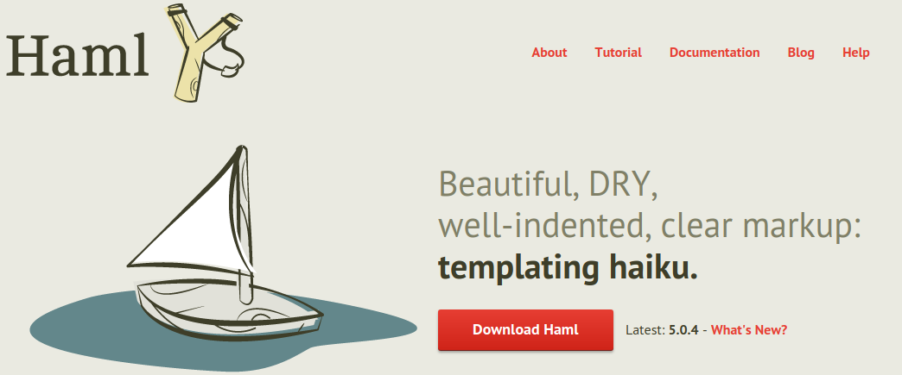

# haml-flask

Use HAML on Flask project and rendering Jinja2 example.

# Haml

[haml.info](http://haml.info/)



> Haml (HTML abstraction markup language)

É baseado em um princípio básico: marcação deve ser bonita.

```
*.haml
%section.container
  %h1= post.title
  %h2= post.subtitle
  .content
    = post.content
```

Em 2010 Jesse Miller criou [github.com/jessemiller/HamlPy](https://github.com/jessemiller/HamlPy)

Logo depois, Appknox (XYSec Labs) criou [github.com/appknox/HamlPy3](https://github.com/appknox/HamlPy3)


## Instalação

```
python3 -m venv .venv
source .venv/bin/activate
pip install hamlpy3
```

### Como usar?

Convertendo .haml em .html

```
hamlpy inputfile.haml index.html
```

#### Referências

https://github.com/appknox/HamlPy3

https://github.com/jessemiller/HamlPy/blob/master/reference.md

https://github.com/jessemiller/HamlPy/blob/master/reference.md#python

http://xahlee.info/comp/haml_basics_tutorial.html
